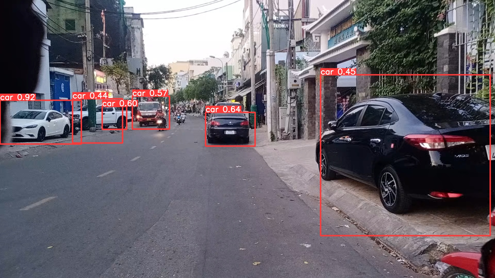

# **TRAINING CUSTOM DATASET**

**TABLE OF CONTENTS**

1. [Create Dataset](#1-create-dataset)  
1.1 [Collect Images](#11-collect-images)  
1.2 [Create Labels](#12-create-labels)  
1.3 [Create Config File](#13-create-config-file)  
2. [Select Model](#2-select-model)
3. [Train](#3-train)
4. [Inference](#4-inference)

## **1. Create Dataset**

### 1.1 Collect Images

- Capture frames from video

```
python3 capture_vid.py --path_vid ./videos/*.mp4 --path_imgs ./dataset/cars
```

### 1.2 Create Labels

Once you have collected images, you will need to annotate the objects of interest to create a ground truth for your model to learn from.

Using `labelImg` tool 

- Install by PyPI 

```
pip3 install labelImg
```

Or build from source [link](https://github.com/heartexlabs/labelImg#build-from-source)

Open **labelImg** tool

```
labelImg
```


- Step 1: Open image folder.
- Step 2: Choose annotation folder.
- Step 3: Choose label file format as YOLO.
- Step 4: Draw a bounding box and annotate label. 
- Step 5: Save annotation.
- Step 6: Continue with next image.

Notes: Some shortkeys

| Shortkey | Descriptions |
| - | - | 
| Ctrl + S | Save annotation |
| Ctrl + D | Copy the current label and rect box |
| Ctrl + Shift + D | Delete the current image |
| W | Create a rect box |
| D | Next image | 
| A | Previous image |
| Delete | Delete the selected rect box |
| Ctrl + + | Zoom in |
| Ctrl + - | Zoom out |

Annotation files (`*.txt`) and label file (`classes.txt`) are obtained in the same folder with images. 

The *.txt file specifications are:

- One row per object
- Each row is `class` `x_center` `y_center` `width` `height` format.
- Box coordinates must be in normalized xywh format (from 0 - 1). If your boxes are in pixels, divide x_center and width by image width, and y_center and height by image height.
- Class numbers are zero-indexed (start from 0).

Example:

The label file corresponding to the above image contains 3 cars (class 0) 


### 1.3 Create Config File

Set up files and directory structure: to train the YOLOv5 model, we need to add a .yaml file to describe the parameters of our dataset.

- Step 1: Split your dataset: we choose how to disperse our data (for example, keep 80% data in the training set and 20% in the validation set).

```
python3 split_dataset.py --path ./datasets/cars
```

Directory & file structures

```
├── datasets
│   ├── cars ├── images ├── *.jpg
|   |        └── labels ├── *.txt
|   |        └── train.txt
|   |        └── val.txt
|   |        └── test.txt
|   |
│   └── other datasets
```

- Step 2: Setup the config file

The *.txt file specifications are:
- `path` is path to training and validation data.
- `nc` is the number of classes.
- `names` is list name of classes.

Example in `./data/custom.yaml`

```
# Train/val/test sets as 1) dir: path/to/imgs, 2) file: path/to/imgs.txt, or 3) list: [path/to/imgs1, path/to/imgs2, ..]

path: ./datasets/cars  # dataset root dir
train: train.txt  # train images 
val: val.txt  # val images 
test: test.txt  # (optional)

nc: 1

# Classes
names: 
  0: car
```

## **2. Select Model**

Select a pretrained model to start training from. Read **Pretrained Checkpoints table** to see a full comparison of all models.

<p align="center"></p>

<details>
<summary>Pretrained Checkpoints table</summary>

| Model                                                                                                | size<br><sup>(pixels) | mAP<sup>val<br>50-95 | mAP<sup>val<br>50 | Speed<br><sup>CPU b1<br>(ms) | Speed<br><sup>V100 b1<br>(ms) | Speed<br><sup>V100 b32<br>(ms) | params<br><sup>(M) | FLOPs<br><sup>@640 (B) |
|------------------------------------------------------------------------------------------------------|-----------------------|----------------------|-------------------|------------------------------|-------------------------------|--------------------------------|--------------------|------------------------|
| [YOLOv5n](https://github.com/ultralytics/yolov5/releases/download/v6.2/yolov5n.pt)                   | 640                   | 28.0                 | 45.7              | **45**                       | **6.3**                       | **0.6**                        | **1.9**            | **4.5**                |
| [YOLOv5s](https://github.com/ultralytics/yolov5/releases/download/v6.2/yolov5s.pt)                   | 640                   | 37.4                 | 56.8              | 98                           | 6.4                           | 0.9                            | 7.2                | 16.5                   |
| [YOLOv5m](https://github.com/ultralytics/yolov5/releases/download/v6.2/yolov5m.pt)                   | 640                   | 45.4                 | 64.1              | 224                          | 8.2                           | 1.7                            | 21.2               | 49.0                   |
| [YOLOv5l](https://github.com/ultralytics/yolov5/releases/download/v6.2/yolov5l.pt)                   | 640                   | 49.0                 | 67.3              | 430                          | 10.1                          | 2.7                            | 46.5               | 109.1                  |
| [YOLOv5x](https://github.com/ultralytics/yolov5/releases/download/v6.2/yolov5x.pt)                   | 640                   | 50.7                 | 68.9              | 766                          | 12.1                          | 4.8                            | 86.7               | 205.7                  |
|                                                                                                      |                       |                      |                   |                              |                               |                                |                    |                        |
| [YOLOv5n6](https://github.com/ultralytics/yolov5/releases/download/v6.2/yolov5n6.pt)                 | 1280                  | 36.0                 | 54.4              | 153                          | 8.1                           | 2.1                            | 3.2                | 4.6                    |
| [YOLOv5s6](https://github.com/ultralytics/yolov5/releases/download/v6.2/yolov5s6.pt)                 | 1280                  | 44.8                 | 63.7              | 385                          | 8.2                           | 3.6                            | 12.6               | 16.8                   |
| [YOLOv5m6](https://github.com/ultralytics/yolov5/releases/download/v6.2/yolov5m6.pt)                 | 1280                  | 51.3                 | 69.3              | 887                          | 11.1                          | 6.8                            | 35.7               | 50.0                   |
| [YOLOv5l6](https://github.com/ultralytics/yolov5/releases/download/v6.2/yolov5l6.pt)                 | 1280                  | 53.7                 | 71.3              | 1784                         | 15.8                          | 10.5                           | 76.8               | 111.4                  |
| [YOLOv5x6](https://github.com/ultralytics/yolov5/releases/download/v6.2/yolov5x6.pt)<br>+ [TTA][tta] | 1280<br>1536          | 55.0<br>**55.8**     | 72.7<br>**72.7**  | 3136<br>-                    | 26.2<br>-                     | 19.4<br>-                      | 140.7<br>-         | 209.8<br>-             |

</details>

- Step 1: Click model name and download it. 
- Step 2: Move downloaded model to path `weights` directory.

## **3. Train**

```
python3 train.py --img 640 --batch 4 --epochs 100 --data data/custom.yaml --weights weights/yolov5s.pt
```

Notes: Training with GPU by adding parse argument  `--devide 0`

All training results are saved to runs/train/ with incrementing run directories, i.e. `runs/train/exp2, runs/train/exp3 etc`.  Move model `best.pt` in `runs/train/exp3/weights` to `weights` folder 

## **4. Inference** 

```
python3 detect.py --source datasets/cars/images/0.jpg --weights weights/best.pt --data data/custom.yaml 
```
Notes:

```
--source    0                               # webcam
            img.jpg                         # image
            vid.mp4                         # video
            screen                          # screenshot
            path/                           # directory
            list.txt                        # list of images
            list.streams                    # list of streams
            'path/*.jpg'                    # glob
            'https://youtu.be/Zgi9g1ksQHc'  # YouTube
            'rtsp://example.com/media.mp4'  # RTSP, RTMP, HTTP stream
```
 
All inferencing results are saved to `runs/detect`

Example:




**REFERENCES**

[Train Custom Data](https://github.com/ultralytics/yolov5/wiki/Train-Custom-Data)


